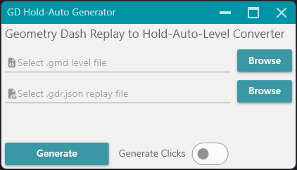

# GDHoldAutoGenerator

## Description
This is a tool for the game "Geometry Dash" to convert a replay file and a level file to a "hold-auto-level".

### hold-auto-level
Hold-auto-levels are a type of auto-level where the player holds down the button for the entire level.
This is possible through the new "options" trigger which was added in update 2.2 
and allows for disabling and re-enabling the player's input.  
This type of auto-level is much more realistic and accurate than previous auto-levels based on invisible objects.

### Usage
To use this tool, you need to have [GDShare](https://github.com/HJfod/GDShare) (can be installed via [Geode](https://geode-sdk.org))
and a tool to generate replays. Currently only [MegaHack](https://absolllute.com/store/mega_hack) is supported.

To generate a hold-auto-level, upload a MegaHack replay file (`.gdr.json`) and the corresponding level file (`.gmd`).
Optionally, you can enable the "generate clicks" option to generate sfx-triggers for click-sounds.
You can then save the generated hold-auto-level as a `.gmd` file and import it into Geometry Dash.